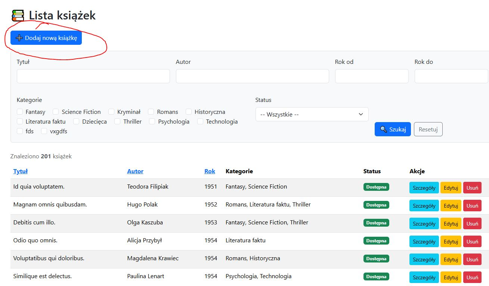
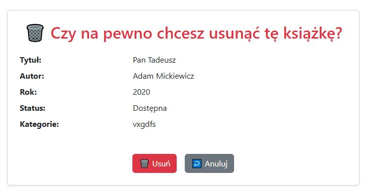
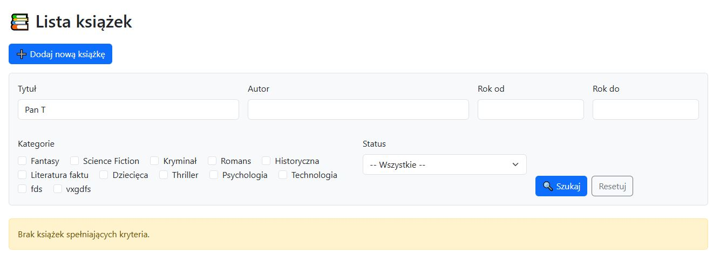
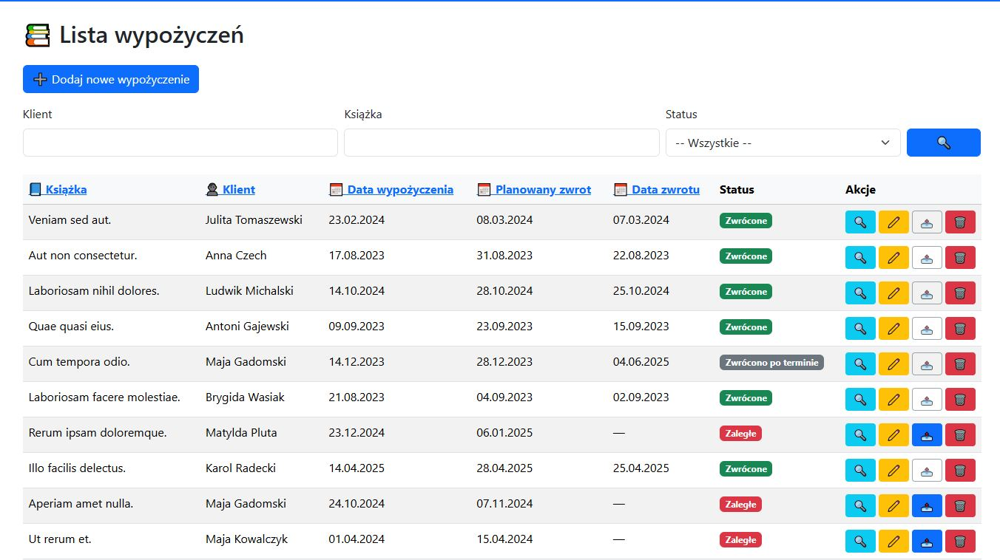
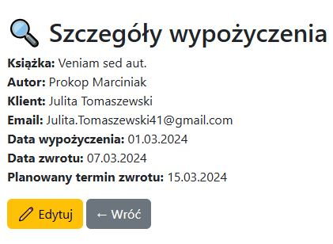

# 📚 Bookly – aplikacja biblioteczna (ASP.NET Razor Pages)

Bookly to aplikacja webowa stworzona w technologii **ASP.NET Core Razor Pages**, umożliwiająca pracownikom biblioteki zarządzanie książkami, klientami oraz historią wypożyczeń.


# Autor: Damian Zwolak 

---

## 📖 Spis treści

- [✅ Funkcjonalności](#-funkcjonalności)
  - [🧾 Książki](#-książki)
  - [👤 Klienci](#-klienci)
  - [🔄 Wypożyczenia](#-wypożyczenia)
  - [📤 Zwroty](#-zwroty)
  - [📜 Historia wypożyczeń](#-historia-wypożyczeń)
- [🛠️ Technologie i użyte biblioteki](#-technologie-i-użyte-biblioteki)
- [⚙️ Wymagania systemowe](#-wymagania-systemowe)
- [🚀 Jak uruchomić aplikację](#-jak-uruchomić-aplikację)
- [📁 Struktura projektu](#-struktura-projektu-)
- [🌱 Dane przykładowe (Seed)](#-dane-przykładowe-seed)
- [🧪 Walidacja i zabezpieczenia](#-walidacja-i-zabezpieczenia)
- [👨‍🏫 Instrukcja obsługi](#-instrukcja-obsługi)
- [🔄 Przebieg działania aplikacji](#przebieg-działania-aplikacji)
## ✅ Funkcjonalności

### 🧾 Książki
- Dodawanie książek (tytuł, autor, rok wydania)
- Przypisywanie jednej lub wielu kategorii (np. Thriller, Historyczna)
- Podgląd statusu: dostępna / wypożyczona

### 👤 Klienci
- Dodawanie klientów (imię, nazwisko, e-mail z walidacją)
- Filtrowanie klientów po imieniu, nazwisku, e-mailu oraz liczbie wypożyczeń

### 🔄 Wypożyczenia
- Wybór klienta i dostępnej książki
- Ustawianie daty wypożyczenia i planowanego zwrotu
- Automatyczna zmiana statusu książki na "wypożyczona"

### 📤 Zwroty
- Edycja wypożyczenia – wprowadzenie daty zwrotu
- Automatyczna zmiana statusu książki na "dostępna"

### 📜 Historia wypożyczeń
- Lista wszystkich wypożyczeń (aktywnych i zakończonych)
- Filtrowanie po książce, kliencie, statusie
- Sortowanie po dacie wypożyczenia, zwrotu, kliencie, książce
- Widok statusu: Wypożyczone, Zwrócone, Zaległe, Zwrócono po terminie

---

## 🛠️ Technologie i użyte biblioteki
- Projekt został zbudowany przy użyciu następujących technologii i bibliotek:
- C# – główny język programowania aplikacji.
- ASP.NET Core 8.0 Razor Pages – framework do budowy dynamicznych aplikacji webowych z wykorzystaniem podejścia page-based.
- Entity Framework Core – nowoczesne narzędzie ORM do mapowania danych i obsługi migracji bazy danych.
- Npgsql.EntityFrameworkCore.PostgreSQL – provider EF Core umożliwiający integrację z bazą PostgreSQL 14.
- Bogus – biblioteka .NET do generowania realistycznych danych testowych (np. tytuły książek, nazwiska klientów); używana w seederze.
- Bootstrap 5 – framework CSS wykorzystywany do tworzenia formularzy, układów i komponentów interfejsu użytkownika.
- System.ComponentModel.DataAnnotations – zestaw atrybutów do walidacji danych, takich jak `[Required]`, `[EmailAddress]`, `[DataType]`.

Aplikacja obsługuje filtrowanie i sortowanie danych na stronach z listami książek, klientów oraz wypożyczeń – ułatwia to szybkie przeszukiwanie i porządkowanie dużych zbiorów danych według różnych kryteriów (np. tytułu, statusu, liczby wypożyczeń, dat).

---

## ⚙️ Wymagania systemowe
- .NET 8 SDK
- PostgreSQL (v14 lub wyższy)
- Visual Studio 2022+ / Rider / VS Code

---

## 🚀 Jak uruchomić aplikację

1. Sklonuj repozytorium:
```bash
git clone https://github.com/dazw00110/Bookly
cd Bookly
```

2. Skopiuj plik `example_appsettings.json` jako `appsettings.json` oraz zaktualizuj połączenie z bazą danych:
```json
"ConnectionStrings": {
  "DefaultConnection": "Host=localhost;Port=5432;Database=bookly;Username=admin;Password=admin"
}
```

3. Utwórz bazę danych PostgreSQL 14 i uruchom migracje:

Utworzenie kontenera Docker z PostgreSQL:

``docker run --name bookly -e POSTGRES_USER=admin -e POSTGRES_PASSWORD=admin -e POSTGRES_DB=bookly -p 5432:5432 -d postgres:14``

Uruchomienie migracji EF Core:
```bash
dotnet ef database update
```

4. Uruchom aplikację:
```bash
dotnet run
```

5. Otwórz przeglądarkę:
```
http://localhost:5159
```

---

## 📁 Struktura projektu 
Tak wygląda struktura projektu Bookly:


Oto krótki opis wszystkich kluczowych folderów i plików projektu:

### 📁 Data/
Zawiera dane związane z bazą:
- `ApplicationDbContext.cs` – główny kontekst Entity Framework Core, mapuje modele na tabele.
- `img/` – folder zawierający obrazy używane w dokumentacji lub interfejsie.

### 📁 Migrations/
Zawiera pliki migracji EF Core – odpowiadają za tworzenie i aktualizowanie struktury bazy danych w czasie rozwoju projektu. Generowane automatycznie komendą `dotnet ef migrations add`.

### 📁 Models/
Zawiera klasy modeli danych: `Book`, `Client`, `Loan`, `Category`, `BookCategory`. To one definiują strukturę danych w aplikacji.

- `Book`
  - Id, Title, Author, Year, IsBorrowed
  - relacja wiele-do-wielu z `Category`
  - relacja jeden-do-wielu z `Loan`

- `Category`
  - Id, Name
  - relacja wiele-do-wielu z `Book`

- `BookCategory` (tabela łącznikowa N:M)

- `Client`
  - Id, FirstName, LastName, Email
  - relacja jeden-do-wielu z `Loan`

- `Loan`
  - Id, BookId, ClientId, LoanDate, PlannedReturnDate, ReturnDate?

### 📁 Pages/
Folder z widokami Razor Pages (pliki `.cshtml` i `.cshtml.cs`) – podzielony zazwyczaj na podfoldery: `Books`, `Clients`, `Loans`, `Categories`. Każdy folder reprezentuje inną sekcję funkcjonalną (CRUD).

### 📁 Seeders/
Zawiera klasę `Seeder.cs` – odpowiedzialną za wypełnienie bazy danych przykładowymi danymi przy pierwszym uruchomieniu (np. książki, klienci).

### 📁 wwwroot/
Folder z zasobami statycznymi: style CSS, pliki graficzne, skrypty JS itd. Domyślnie zawiera zasoby dla Bootstrap i inne pliki statyczne strony.

### 📁 Properties/
Standardowy folder .NET – zawiera m.in. plik `launchSettings.json`, który konfiguruje sposób uruchamiania projektu (np. port lokalny).

---

## 🗂️ Kluczowe pliki

- `Program.cs` – punkt wejścia aplikacji, konfiguruje serwer, routing, usługi Razor Pages i bazę danych.
- `README.md` – dokumentacja projektu (ta, którą czytasz).
- `appsettings.json` – główny plik konfiguracyjny: połączenie z bazą danych, logowanie, itp.
- `appsettings.Development.json` – wersja konfiguracyjna dla środowiska developerskiego.
- `example_appsettings.json` – szablon pliku konfiguracyjnego do przekazania innym użytkownikom repo.
- `.gitignore` – plik określający, które pliki/foldery mają nie być śledzone przez Gita.
- `global.json` – opcjonalny plik określający wersję SDK .NET używaną w projekcie.

---

## 🌱 Dane przykładowe (Seed)
Po uruchomieniu aplikacji w bazie pojawi się przykładowe:
- 200 książek
- 10 kategorie
- 50 klientów
- 30 wypożyczenia

---

## 🧪 Walidacja i zabezpieczenia
- Walidacja [Required], [EmailAddress], [DataType(Date)]
- Sprawdzenie czy książka nie jest już wypożyczona
- Zakaz ustawiania daty zwrotu wcześniejszej niż data wypożyczenia
- Zakaz ustawiania planowanego zwrotu wcześniejszego niż data wypożyczenia

---

## 👨‍🏫 Instrukcja obsługi

1. Dodaj kilka kategorii w zakładce Kategorie
2. Dodaj książki przypisując im jedną lub więcej kategorii
3. Dodaj klientów
4. Przejdź do „Wypożyczenia” i utwórz nowe – wybierz klienta i książkę
5. W zakładce „Wypożyczenia” możesz:
    - kliknąć Szczegóły aby zobaczyć dane
    - kliknąć Edytuj aby zmienić dane
    - kliknąć Zwrot aby ustawić datę oddania książki
    - kliknąć Usuń aby usunąć rekord
6. Możesz filtrować listę wypożyczeń po statusie, kliencie, książce oraz sortować po dacie wypożyczenia, zwrotu, kliencie, książce

---


## Przebieg działania aplikacji

### Strona główna aplikacji:

Na stronie głównej znajdują się linki do wszystkich sekcji aplikacji: Książki, Klienci, Wypożyczenia, Kategorie oraz Historia wypożyczeń.
Na podstrony można przejść klikając odpowiednie linki w menu nawigacyjnym lub klikając na sekcje z obrazkami.
My przejdziemy na stronę książek, aby zobaczyć jak wygląda zarządzanie książkami w aplikacji.

### Podstrona Książek:

Na stronie książek widzimy listę wszystkich książek w bibliotece. Możemy filtrować książki po tytule, autorze, roku wydania oraz statusie (dostępna/wypożyczona).
Możemy również sortować książki po tytule, autorze, roku wydania oraz statusie, a także dodawać, edytować i usuwać książki. Mamy też możliwość przejścia do szczegółów książki, klikając na tytuł książki.

#### Filtrowanie:
Książki możemy filtrować po tytule, autorze, roku wydania oraz statusie (dostępna/wypożyczona). Wystarczy wpisać frazę w odpowiednie pole i kliknąć przycisk "Filtruj".

Przykład filtrowania książek po tytule:
- Przed filtorwaniem

- Po filtrze
Wpisaliśmy "Dolorum" w pole tytułu i kliknęliśmy "Filtruj":
Skutek działania filtra:

- Resetowanie filtrów - Aby zresetować filtry, wystarczy kliknąć przycisk "Resetuj filtry". Spowoduje to przywrócenie pierwotnej listy książek.


Przykład filtrowania książek po autorze:
- Przed filtrowaniem!

- Po filtrze - Wpisaliśmy "Robert" w pole autora i kliknęliśmy "Filtruj":


Przykład filtrowania książek po roku wydania:
- Przed filtrowaniem

- Po filtorwaniu - Wybraliśmy daty miedzy 2001 i 2010 i kliknęliśmy "Filtruj":


Przykład filtrowania książek po statusie:
- Przed filtrowaniem

- Po filtrze - Wybraliśmy status "Dostępna" i kliknęliśmy "Filtruj":


#### Sortowanie:
Książki możemy sortować po tytule, autorze, roku wydania oraz statusie. Wystarczy kliknąć na nagłówek kolumny, po której chcemy sortować.

Przykład sortowania książek po tytule:
- Przed sortowaniem

- Po sortowaniu 

- Sortowanie działa zarówno rosnąco, jak i malejąco. Aby zmienić kierunek sortowania, wystarczy ponownie kliknąć na nagłówek kolumny.)


Przykład sortowania książek po autorze:
- Przed sortowaniem

- Po sortowaniu


Przykład sortowania książek po roku wydania:
- Przed sortowaniem

- Po sortowaniu


#### Dodawanie książki:
Aby dodać nową książkę, klikamy przycisk "Dodaj książkę" w prawym lewym rogu strony. Otworzy się formularz, w którym możemy wprowadzić dane książki.

W formularzu należy wypełnić następujące pola:
- Tytuł (wymagane)
- Autor (wymagane)
- Rok wydania (wymagane, musi być liczbą całkowitą)
- Kategoria (wymagane, możemy wybrać jedną lub więcej kategorii z listy)

Po wypełnieniu formularza klikamy przycisk "Zapisz", aby dodać książkę do bazy danych. Jeśli dane są poprawne, zostaniemy przekierowani z powrotem na stronę książek, gdzie zobaczymy nową książkę na liście.

Wypełniamy formualarz przykładowymi danymi i klikamy "Zapisz":


Po kliknięciu "Zapisz" zostaniemy przekierowani z powrotem na stronę książek, gdzie zobaczymy nową książkę na liście:


#### Szczegóły książki:
Aby zobaczyć szczegóły książki, klikamy na tytuł książki na liście. Otworzy się strona z informacjami o książce, gdzie możemy zobaczyć wszystkie dane oraz historię wypożyczeń tej książki.

Widok szczegółów książki zawiera:

Na stronie szczegółów książki możemy zobaczyć:
- Tytuł, autor, rok wydania
- Kategorie przypisane do książki
- Lista wypożyczeń tej książki (jeśli istnieją)
- Przycisk "Edytuj", aby zmienić dane książki
- Przycisk "Usuń", aby usunąć książkę z bazy danych

#### Edycja książki:
Aby edytować książkę, klikamy przycisk "Edytuj" na stronie szczegółów książki. Otworzy się formularz z danymi książki, które możemy zmienić. Możemy także edytować książkę poprzez listę książek, klikając przycisk "Edytuj" obok tytułu książki.


W formularzu edycji możemy zmienić:
- Tytuł
- Autor
- Rok wydania
- Kategorie (możemy dodać lub usunąć kategorie)

Zmieniamy rok na 2020 i zapisujemy zmiany klikając "Zapisz":


Po zapisaniu zmian zostaniemy przekierowani z powrotem na stronę książek, gdzie zobaczymy zaktualizowaną książkę na liście:


#### Usuwanie książki:
Aby usunąć książkę, klikamy przycisk "Usuń" na stronie szczegółów książki lub obok tytułu książki na liście. Pojawi się okno potwierdzenia usunięcia.
Po potwierdzeniu usunięcia książka zostanie usunięta z bazy danych i przekierowani zostaniemy z powrotem na stronę książek, gdzie zobaczymy, że książka została usunięta z listy.


Jak widać, książka została usunięta z listy książek:


### Kategorie:

Na stronie kategorii widzimy listę wszystkich kategorii w bibliotece. Ta podstrona działa bardzo podobnie do strony książek. Możemy filtrować kategorie po nazwie, sortować je oraz dodawać, edytować i usuwać kategorie. Mamy też możliwość przejścia do szczegółów kategorii, klikając na nazwę kategorii.
Filtorawanie i sortowanie działają tak samo jak na stronie książek, więc nie będziemy tego powtarzać.

#### Dodawanie kategorii:
Formularz dodawania kategorii wygląda troche inaczej niż formularz dodawania książki, ponieważ kategorie mają tylko jedno pole - nazwę kategorii.

Wypełniamy pole nazwy kategorii przykładową nazwą i klikamy "Zapisz":


Spróbujemy przypisać jakąś książkę do tej kategorii, ale nie możemy tego zrobić, ponieważ nie mamy jeszcze żadnej książki w bazie danych. Musimy najpierw dodać książkę, aby móc przypisać ją do kategorii.


Jak widać, po dodaniu kategorii zostaliśmy przekierowani z powrotem na stronę kategorii, gdzie zobaczymy nową kategorię na liście:


Spróbujemy teraz wyświetlić szczegóły kategorii, klikając na nazwę kategorii na liście:

Jak widać do kategorii została przypisana książka, którą dodaliśmy wcześniej. Możemy zobaczyć wszystkie książki przypisane do tej kategorii oraz historię wypożyczeń tych książek.


#### Edycja książek
Aby edytować książkę musimy wejść na stronę główną i dla podanej książki kliknąć na "Edytuj":


Najpierw sprawdzimy jaka książka należy do tej kategorii:


Sprawdzamy czy kategoria została zmodyfikowana
Pozostałe funkcjonalności kategorii działają tak samo jak w przypadku książek, więc nie będziemy ich powtarzać.


Jak widać modyfikacja kategorii działa
### Podstrona klientów:

Na podstronie klientów możemy zarządzać klientami biblioteki. Tak jak w przypadku książek i kategorii, dostępne są funkcje filtrowania, sortowania, dodawania, edycji, szczegółów oraz usuwania klientów.

#### Filtrowanie klientów:
Klientów można filtrować po:
- Imieniu
- Nazwisku
- E-mailu
- Liczbie wypożyczeń

**Przykład filtrowania klientów po imieniu:**
- Przed filtrowaniem:

- Po filtrowaniu (wpisaliśmy "Anna" w pole "Imię" i kliknęliśmy "Filtruj"):

Resetowanie filtrów działa tak samo jak w przypadku książek i kategorii – klikamy "Resetuj filtry", aby powrócić do pierwotnej listy.


#### Sortowanie klientów:
Klientów możemy sortować po dowolnej kolumnie, na przykład:
- Imieniu
- Nazwisku
- E-mailu
- Liczbie wypożyczeń

Działa tak samo jak w przypadku innych podstron.
Kliknięcie na nagłówek kolumny sortuje listę klientów rosnąco lub malejąco.

#### Dodawanie klienta:
Aby dodać nowego klienta, kliknij "Dodaj klienta". Zostanie wyświetlony formularz, w którym należy wprowadzić:
- Imię
- Nazwisko
- E-mail (pole z walidacją formatu)


Wypełniamy formularz


Po dodaniu wypełnionego formularz
a (np. `Jan Kowalski`, `jan.kowalski@example.com`) klikamy "Zapisz". Jeśli dane są poprawne, klient pojawi się na liście:

#### Szczegóły klienta:
Kliknięcie nazwiska klienta otwiera widok szczegółów, gdzie można zobaczyć:
- Imię, nazwisko, e-mail klienta
- Listę wypożyczeń przypisanych do tego klienta
  

#### Edycja klienta:
- Możemy edytować dane klienta, klikając przycisk "Edytuj" na stronie szczegółów lub na liście klientów.


Przykład edycji: zmiana adresu e-mail z `jan.kowalski@example.com` na `jkowalski@example.com`:


Po zapisaniu zmiany, nowe dane będą widoczne na liście klientów:


#### Usuwanie klienta:
Klienta można usunąć, klikając "Usuń" na liście klientów lub w szczegółach klienta. 


Tak jak w przypadku innych usuwanych elementów, wyświetli się okno potwierdzające usunięcie.


Sprawdzamy czy na pewno klient został usunięty:

---

### Podstrona wypożyczeń:
Podstrona wypożyczeń zawiera listę wypożyczeń w systemie. Podobnie jak w innych sekcjach, możemy filtrować, sortować i dodawać informacje o wypożyczeniach.


Na stronie w tabelce możemy zobaczyć kolumne akcje z przyciskami:
- lupa - zobacz szczegóły zamówienia
- ołówek - edytuj zamówienie
- button ze strzałką - ustaw status na zwrócono lub zwrócono po terminie w zależności od tego czy data zwrotu jest późniejsza niż planowany zwrot czy nie; button jest aktywny tylko dla jeszcze nie zwróconych zawmówień
- śmietnik - usuń zamówienie


Statusy dzielimy na:
  - aktywne - jeszcze nie oddane
  - zwrócone - już oddane


Każda z tych kategorii ma w sobie dokładniejszy status


Aktywne:
- Zaległe - jeszcze nie oddane, ale już minął termin planowanego oddania
- Wypożyczone - jeszcze nie oddane, ale termin jeszcze nie minął


Zwrócone:
- Zwrócone w terminie
- Zwrócone po terminie

Statusy aktywne, mają dostępną opcję zwrotu za pomocą 3 przycisku od lewej. Przycisk ten odpowiada za wstawienie statusu zwrotu na datę dzisiejszą oraz ustawienie statusu na zwrócony lub zwrócony po terminie w zależności czy klient zmieścił się w planowym czasie wypożyczenia książki. 

#### Dodawanie wypożyczenia:

Aby dodać nowe wypożyczenie, klikamy "Dodaj wypożyczenie", po czym wypełniamy formularz:
- Wybieramy klienta z listy
- Wybieramy książkę (spośród dostępnych) także z listy
- Wybieramy datę wypożyczenia i planowaną datę zwrotu


Formularz posiada walidacje dat:
- data wypożyczenia nie może być z przyszłości
- planowana data zwrotu musi być późniejsza niż data wypożyczenia

Jak widać zamówienie zostało dodane.
Modyfikacja zamówień wpływa także na powiązane tabele:

- w tabeli klient w szczegółach klienta dopisze się nowe wypożyczenie


- w tabeli książki w szczególach książki pokaże się nowe wypożyczneie

#### Edycja i zwrot wypożyczenia:
Wyświetlamy tabele wypożyczeń, a następnie wybieramy przycisk edytuj.


Pokaże nam się formularz do edycji wypożyczenie identyczny jak przy tworzeniu:


Aby edytować wypożyczenie (np. wprowadzić datę zwrotu), klikamy "Edytuj" lub "Zwrot", wybieramy odpowiednią datę, a książka uzyska status "dostępna".


Zmieniliśmy datę na 01.03.2024


#### Szczegóły wypożyczenia:
Strona szczegółów wypożyczenia zawiera wszystkie informacje na temat danego rekordu:
- Klient
- Książka
- Data wypożyczenia
- Planowana data zwrotu
- Data zwrotu (jeśli istnieje)

Aby wyświetlić szczegóły zamówienia naciskamy na przycisk lupy w kolumnie Akcja:


W nowym oknie możemy zobaczyć szczegółowe statystyki dla każdego zamówienia: 


#### Usuwanie wypożyczenia:
Wypożyczenie można usunąć w podobny sposób do innych danych w systemie.


W nowym okienku potwierdzamy usuniecie


Jak widać nie ma już takiego wypożyczenia


