# 📚 Bookly – aplikacja biblioteczna (ASP.NET Razor Pages)

Bookly to aplikacja webowa stworzona w technologii **ASP.NET Core Razor Pages**, umożliwiająca pracownikom biblioteki zarządzanie książkami, klientami oraz historią wypożyczeń.


# Autor: Damian Zwolak 

---

## 📖 Spis treści

- [✅ Funkcjonalności](#-funkcjonalności)
  - [🧾 Książki](#-książki)
  - [👤 Klienci](#-klienci)
  - [🔄 Wypożyczenia](#-wypożyczenia)
  - [📤 Zwroty](#-zwroty)
  - [📜 Historia wypożyczeń](#-historia-wypożyczeń)
- [🛠️ Technologie i użyte biblioteki](#-technologie-i-użyte-biblioteki)
- [⚙️ Wymagania systemowe](#-wymagania-systemowe)
- [🚀 Jak uruchomić aplikację](#-jak-uruchomić-aplikację)
- [📁 Struktura projektu](#-struktura-projektu-)
- [🌱 Dane przykładowe (Seed)](#-dane-przykładowe-seed)
- [🧪 Walidacja i zabezpieczenia](#-walidacja-i-zabezpieczenia)
- [👨‍🏫 Instrukcja obsługi](#-instrukcja-obsługi)
- [🖥️ Zrzuty ekranu](#-zrzuty-ekranu)
  - [Strona główna aplikacji](#strona-główna-aplikacji)
  - [Podstrona książek](#podstrona-książek)
    - [Funkcjonalności Książki](#Funkcjonalności-książki) 
      - [Dodawanie książki](#dodawanie-książki)
      - [Szczegóły książki](#szczegóły-książki)
      - [Edycja książki](#edycja-książki)
      - [Usuwanie książki](#usuwanie-książki)
  - [Podstrona kategorii](#podstrona-kategorii)
    - [Funkcjonalności](#funkcjonalności-kategorii) 
      - [Dodawanie kategorii](#dodawanie-kategorii)
      - [Edycja kategorii](#edycja-kategorii)
      - [Usuwanie kategorii](#usuwanie-kategorii)
      - [Szczegóły kategorii](#szczegóły-kategorii)
  - [Podstrona klientów](#podstrona-klientów)
    - [Funkcjonalności klientów](#Funkcjonalności-klientów)
        - [Dodawanie klienta](#dodawanie-klienta)
        - [Edycja klienta](#edycja-klienta)
        - [Usuwanie klienta](#usuwanie-klienta)
        - [Szczegóły klienta](#szczegóły-klienta)
  - [Podstrona wypożyczeń](#podstrona-wypożyczeń)
    - [Funkcjonalności wypożyczeń](#funkcjonalności-wypożyczeń)
        - [Szczegóły wypożyczenia](#szczegóły-wypożyczenia)
        - [Dodawanie wypożyczenia](#dodawanie-wypożyczenia)
        - [Edycja wypożyczenia](#edycja-wypożyczenia)
        - [Usuwanie wypożyczenia](#usuwanie-wypożyczenia)
        - [Zwrot wypożyczenia](#zwrot-wypożyczenia)

---
## ✅ Funkcjonalności

### 🧾 Książki
- Dodawanie książek (tytuł, autor, rok wydania)
- Przypisywanie jednej lub wielu kategorii (np. Thriller, Historyczna)
- Podgląd statusu: dostępna / wypożyczona

### 👤 Klienci
- Dodawanie klientów (imię, nazwisko, e-mail z walidacją)
- Filtrowanie klientów po imieniu, nazwisku, e-mailu oraz liczbie wypożyczeń

### 🔄 Wypożyczenia
- Wybór klienta i dostępnej książki
- Ustawianie daty wypożyczenia i planowanego zwrotu
- Automatyczna zmiana statusu książki na "wypożyczona"

### 📤 Zwroty
- Edycja wypożyczenia – wprowadzenie daty zwrotu
- Automatyczna zmiana statusu książki na "dostępna"

### 📜 Historia wypożyczeń
- Lista wszystkich wypożyczeń (aktywnych i zakończonych)
- Filtrowanie po książce, kliencie, statusie
- Sortowanie po dacie wypożyczenia, zwrotu, kliencie, książce
- Widok statusu: Wypożyczone, Zwrócone, Zaległe, Zwrócono po terminie

---

## 🛠️ Technologie i użyte biblioteki
- Projekt został zbudowany przy użyciu następujących technologii i bibliotek:
- C# – główny język programowania aplikacji.
- ASP.NET Core 8.0 Razor Pages – framework do budowy dynamicznych aplikacji webowych z wykorzystaniem podejścia page-based.
- Entity Framework Core – nowoczesne narzędzie ORM do mapowania danych i obsługi migracji bazy danych.
- Npgsql.EntityFrameworkCore.PostgreSQL – provider EF Core umożliwiający integrację z bazą PostgreSQL 14.
- Bogus – biblioteka .NET do generowania realistycznych danych testowych (np. tytuły książek, nazwiska klientów); używana w seederze.
- Bootstrap 5 – framework CSS wykorzystywany do tworzenia formularzy, układów i komponentów interfejsu użytkownika.
- System.ComponentModel.DataAnnotations – zestaw atrybutów do walidacji danych, takich jak `[Required]`, `[EmailAddress]`, `[DataType]`.

Aplikacja obsługuje filtrowanie i sortowanie danych na stronach z listami książek, klientów oraz wypożyczeń – ułatwia to szybkie przeszukiwanie i porządkowanie dużych zbiorów danych według różnych kryteriów (np. tytułu, statusu, liczby wypożyczeń, dat).

---

## ⚙️ Wymagania systemowe
- .NET 8 SDK
- PostgreSQL (v14 lub wyższy)
- Visual Studio 2022+ / Rider / VS Code

---

## 🚀 Jak uruchomić aplikację

1. Sklonuj repozytorium:
```bash
git clone https://github.com/dazw00110/Bookly
cd Bookly
```

2. Skopiuj plik `example_appsettings.json` jako `appsettings.json` oraz zaktualizuj połączenie z bazą danych:
```json
"ConnectionStrings": {
  "DefaultConnection": "Host=localhost;Port=5432;Database=bookly;Username=admin;Password=admin"
}
```

3. Utwórz bazę danych PostgreSQL 14 i uruchom migracje:

Utworzenie kontenera Docker z PostgreSQL:

``docker run --name bookly -e POSTGRES_USER=admin -e POSTGRES_PASSWORD=admin -e POSTGRES_DB=bookly -p 5432:5432 -d postgres:14``

Uruchomienie migracji EF Core:
```bash
dotnet ef database update
```

4. Uruchom aplikację:
```bash
dotnet run
```

5. Otwórz przeglądarkę:
```
http://localhost:5159
```

---

## 📁 Struktura projektu 
Tak wygląda struktura projektu Bookly:


Oto krótki opis wszystkich kluczowych folderów i plików projektu:

### 📁 Data/
Zawiera dane związane z bazą:
- `ApplicationDbContext.cs` – główny kontekst Entity Framework Core, mapuje modele na tabele.
- `img/` – folder zawierający obrazy używane w dokumentacji lub interfejsie.

### 📁 Migrations/
Zawiera pliki migracji EF Core – odpowiadają za tworzenie i aktualizowanie struktury bazy danych w czasie rozwoju projektu. Generowane automatycznie komendą `dotnet ef migrations add`.

### 📁 Models/
Zawiera klasy modeli danych: `Book`, `Client`, `Loan`, `Category`, `BookCategory`. To one definiują strukturę danych w aplikacji.

- `Book`
  - Id, Title, Author, Year, IsBorrowed
  - relacja wiele-do-wielu z `Category`
  - relacja jeden-do-wielu z `Loan`

- `Category`
  - Id, Name
  - relacja wiele-do-wielu z `Book`

- `BookCategory` (tabela łącznikowa N:M)

- `Client`
  - Id, FirstName, LastName, Email
  - relacja jeden-do-wielu z `Loan`

- `Loan`
  - Id, BookId, ClientId, LoanDate, PlannedReturnDate, ReturnDate?

### 📁 Pages/
Folder z widokami Razor Pages (pliki `.cshtml` i `.cshtml.cs`) – podzielony zazwyczaj na podfoldery: `Books`, `Clients`, `Loans`, `Categories`. Każdy folder reprezentuje inną sekcję funkcjonalną (CRUD).

### 📁 Seeders/
Zawiera klasę `Seeder.cs` – odpowiedzialną za wypełnienie bazy danych przykładowymi danymi przy pierwszym uruchomieniu (np. książki, klienci).

### 📁 wwwroot/
Folder z zasobami statycznymi: style CSS, pliki graficzne, skrypty JS itd. Domyślnie zawiera zasoby dla Bootstrap i inne pliki statyczne strony.

### 📁 Properties/
Standardowy folder .NET – zawiera m.in. plik `launchSettings.json`, który konfiguruje sposób uruchamiania projektu (np. port lokalny).

---

## 🗂️ Kluczowe pliki

- `Program.cs` – punkt wejścia aplikacji, konfiguruje serwer, routing, usługi Razor Pages i bazę danych.
- `README.md` – dokumentacja projektu (ta, którą czytasz).
- `appsettings.json` – główny plik konfiguracyjny: połączenie z bazą danych, logowanie, itp.
- `appsettings.Development.json` – wersja konfiguracyjna dla środowiska developerskiego.
- `example_appsettings.json` – szablon pliku konfiguracyjnego do przekazania innym użytkownikom repo.
- `.gitignore` – plik określający, które pliki/foldery mają nie być śledzone przez Gita.
- `global.json` – opcjonalny plik określający wersję SDK .NET używaną w projekcie.

---

## 🌱 Dane przykładowe (Seed)
Po uruchomieniu aplikacji w bazie pojawi się przykładowe:
- 200 książek
- 10 kategorie
- 50 klientów
- 30 wypożyczenia

---

## 🧪 Walidacja i zabezpieczenia
- Walidacja [Required], [EmailAddress], [DataType(Date)]
- Sprawdzenie czy książka nie jest już wypożyczona
- Zakaz ustawiania daty zwrotu wcześniejszej niż data wypożyczenia
- Zakaz ustawiania planowanego zwrotu wcześniejszego niż data wypożyczenia

---

## 👨‍🏫 Instrukcja obsługi

1. Dodaj kilka kategorii w zakładce Kategorie
2. Dodaj książki przypisując im jedną lub więcej kategorii
3. Dodaj klientów
4. Przejdź do „Wypożyczenia” i utwórz nowe – wybierz klienta i książkę
5. W zakładce „Wypożyczenia” możesz:
    - kliknąć Szczegóły aby zobaczyć dane
    - kliknąć Edytuj aby zmienić dane
    - kliknąć Zwrot aby ustawić datę oddania książki
    - kliknąć Usuń aby usunąć rekord
6. Możesz filtrować listę wypożyczeń po statusie, kliencie, książce oraz sortować po dacie wypożyczenia, zwrotu, kliencie, książce

---

## 🖥️ Zrzuty ekranu
### Strona główna aplikacji:
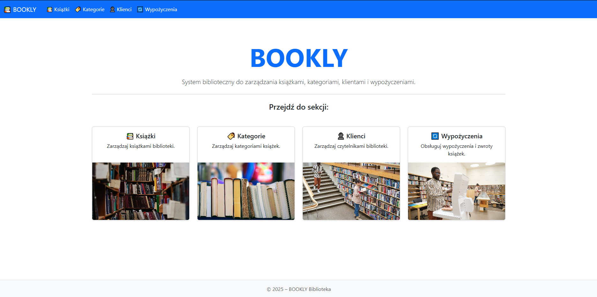
### Podstrona książek:
#### Strona główna:
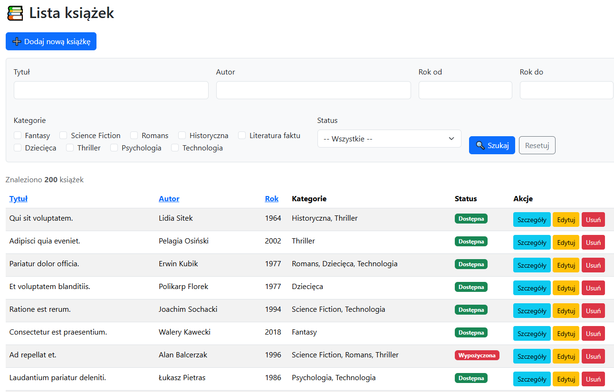

### Funkcjonalności Książki:
#### Dodanie książki:
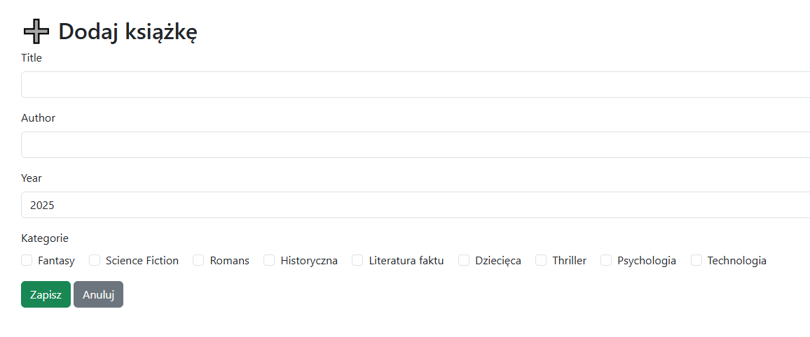

#### Szczegóły książki:
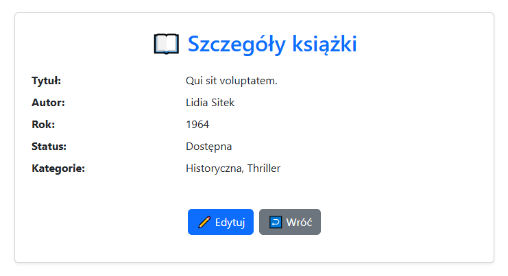

#### Edycja książki:
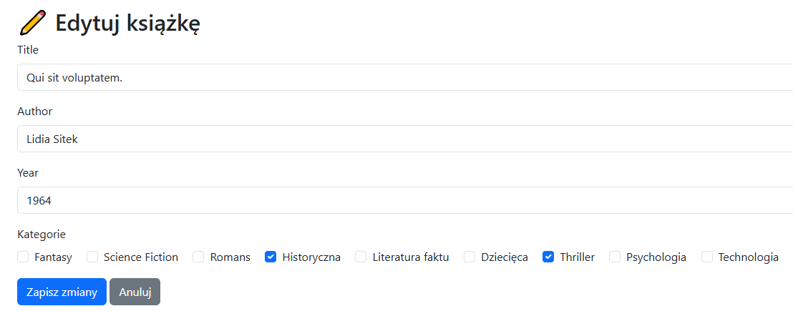

#### Uusuwanie książki:
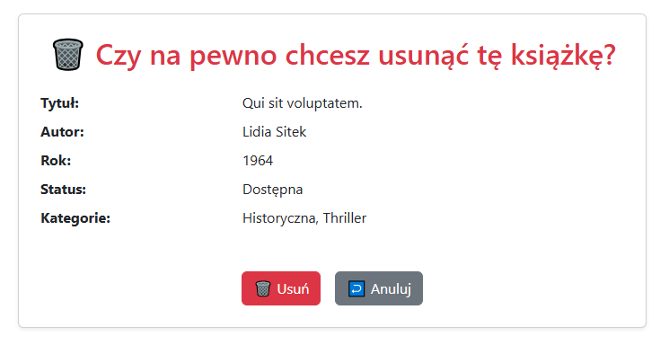

### Podstrona kategorii:
#### Strona główna:
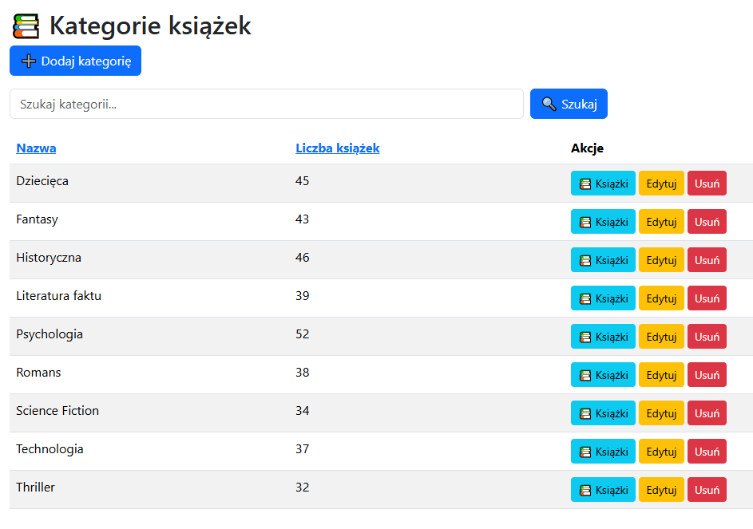

### Funkcjonalności Kategorii:
#### Dodawanie kategorii:
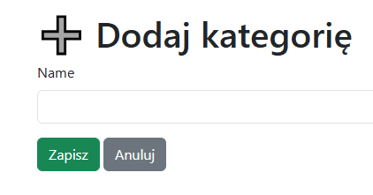

#### Edycja kategorii:
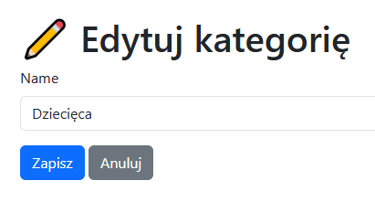

#### Usuwanie kategorii:
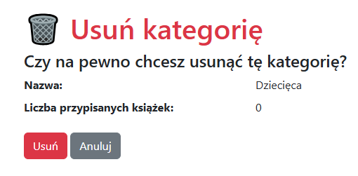

#### Szczegóły kategorii:
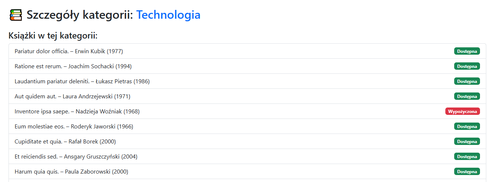

### Podstrona klientów:
#### Strona główna:
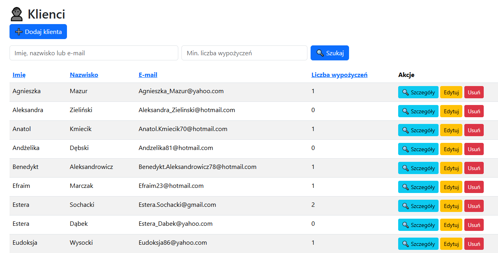

### Funkcjonalności Klientów:
#### Dodawanie klienta:
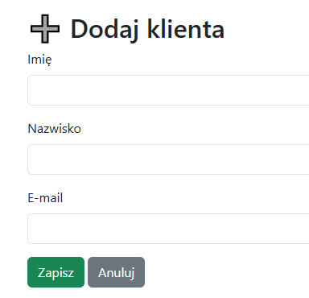

#### Edycja klienta:
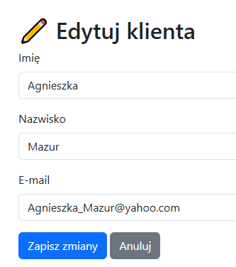

#### Usuwanie klienta:


#### Szczegóły klienta:
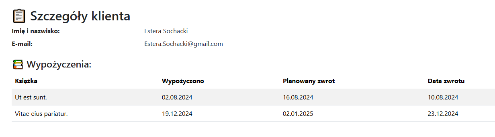

### Podstrona wypożyczeń:
#### Strona główna:
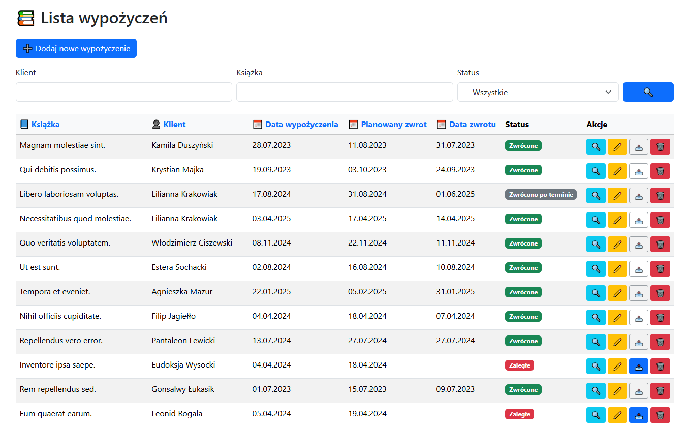

### Funkcjonalności wypożyczeń:
#### Szczegóły wypożyczenia:
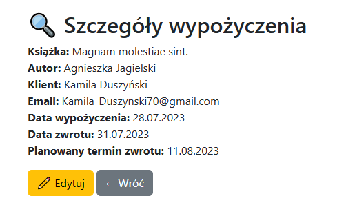

#### Dodawanie wypożyczenia:
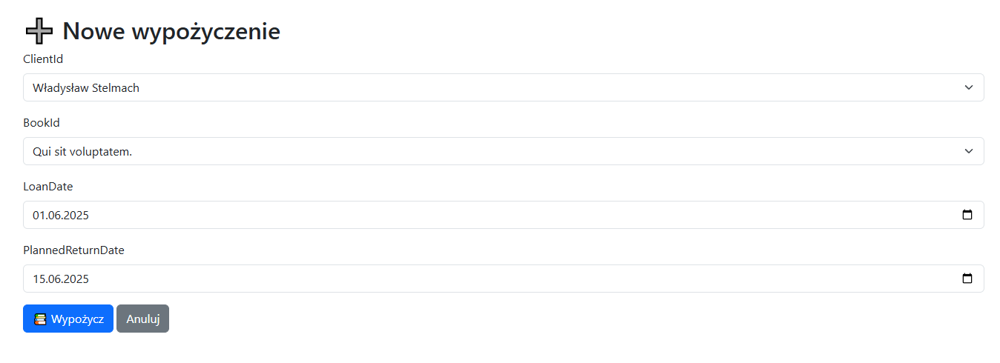

#### Edycja wypożyczenia:


#### Usuwanie wypożyczenia:


#### Zwrot wypożyczenia:
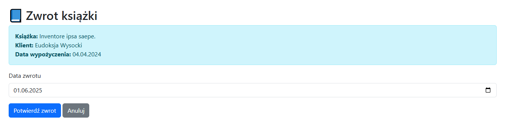

